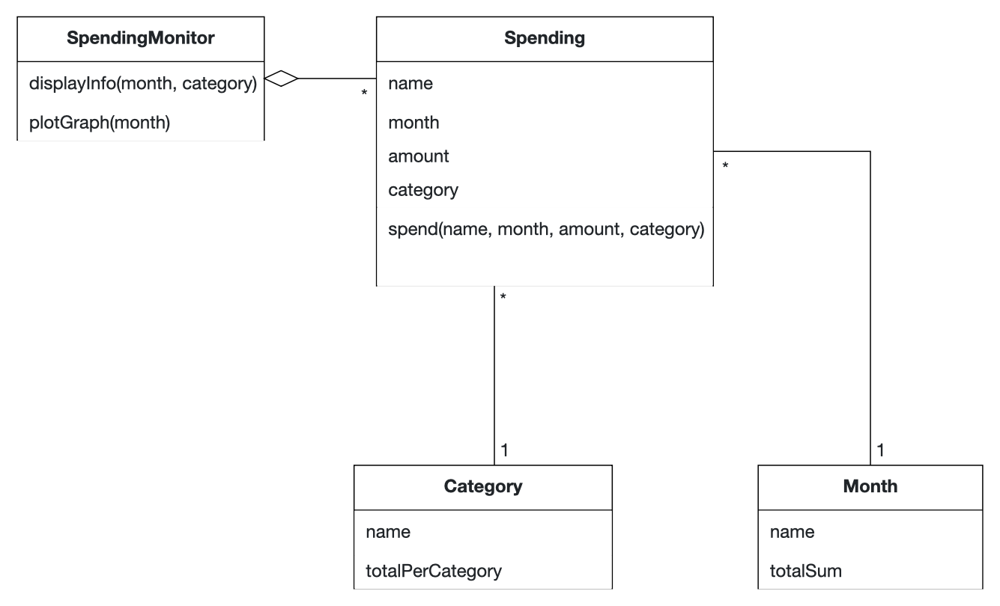
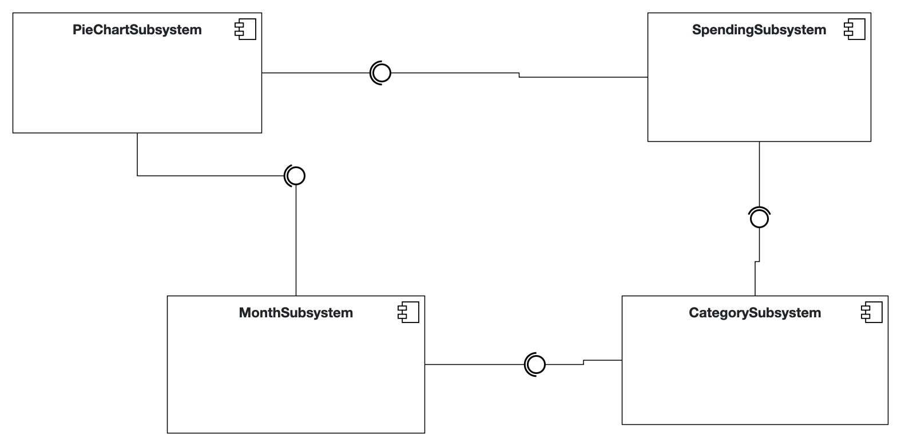

## Problem Statement

Many individuals face challenges in monitoring and managing their expenses effectively. While some banking apps offer expense tracking, they often miss expenses paid in cash, and lack the ability to filter expenses by categories.

I am seeking an iOS application that provides a comprehensive solution for tracking monthly expenses. The app should allow users to categorize expenses and filter them based on the assigned categories. The app should display the expenses in descending order based on the amount, allowing users to view their expenses from highest to lowest amount. Additionally, it should display the total expenses per month and per category, and provide a visual representation of the monthly expenses in the form of a pie chart.

## Requirements

**Funtional requirements:**

- Categorize expenses: The app should divide the expenses in different categories

- Filter expenses: The app should filter the expenses based on the assigned month and category

- Display graphs: The app should display a graph depicting total money spent in each category per month

- Sort expenses: The expenses should be presented in descending order

**Non Functional Requirements:**

- Reliability: The application should be reliable and available to users whenever they need it

- Usability: The app should adhere to Apple's Human Interface Guidelines (HIG) and support dark mode
  
- Portability: The app should be portable and able to run on different iOS versions

- Accuracy: The app should maintain high accuracy in processing and displaying data 

## Analysis

 

## System Design

## Product Backlog

| ID | Description |
|------------|-------------|
| BUDPIE1      | Track expenses effectively |
| BUDPIE2      | Categorize expenses for easy filtering |
| BUDPIE3      | View expenses in descending order by amount |
| BUDPIE4      | Display total expenses per month and per category |
| BUDPIE5      | Visualize monthly expenses with a pie chart |

